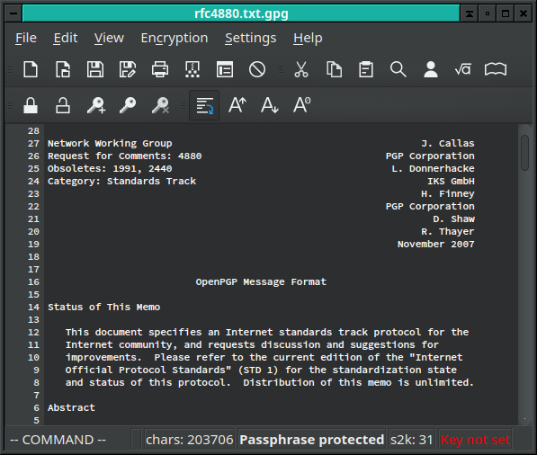

#EncryptPad

EncryptPad is an application for viewing and editing symmetrically encrypted text. It also provides a tool for encrypting and decrypting binary files on disk. The application offers effective measures for protecting information with simple and convenient graphical and command line interface. The editor uses most widely chosen quality file format **OpenPGP** [RFC 4880](https://tools.ietf.org/html/rfc4880). Unlike other OpenPGP software which main purpose is asymmetric encryption, the primary focus of EncryptPad is symmetric encryption.

Screenshots and tutorials are at [evpo.net/encryptpad/](http://evpo.net/encryptpad/)

##Table of Contents
* [Features](#features)
* [Supported Platforms](#supported-platforms)
* [Why EncryptPad?](#why-encryptpad)
* [When Do I Need EncryptPad?](#when-encryptpad)
* [When Can I Not Use EncryptPad?](#when-can-i-not)
* [File Types](#file-types)
  - [GPG](#gpg)
  - [EPD](#epd)
  - [Feature Support](#feature-support)
* [What Is EncrypPad Key File?](#key-file)
* [EPD File Format When Encrypting With a Key](#epd-file-format)
* [Use cURL To Automatically Download Keys From A Remote Storage](#use-curl)
* [Known Weaknesses](#known-weaknesses)
* [Command Line Interface](#command-line-interface)
* [Build EncryptPad on Windows](#build-on-windows)
  - [Prerequisites](#prerequisites)
  - [Steps](#steps)
* [Build EncryptPad on Mac/Linux](#build-on-mac-linux)
    - [Fedora](#build-on-fedora)
* [Acknowledgements](#acknowledgements)
* [EncryptPad Integrity Verification](#integrity-verification)
    - [OpenPGP Singing and Certification Authority](#openpgp-signing)
    - [Step by Step Verfification Process](#verification-process)
* [License](#license)
* [Contacts and Feedback](#contacts)

##Features

* **Symmetric** encryption
* **Password** protection
* **Key file** protection
* Combination of **password and key file**
* Random **key file generator** 
* **Key repository** in a hidden directory in user's home folder
* Path to a key file can be stored in an encrypted file. If enabled, **you do not need to specify the key file** every time you open files.
* Encryption of **binary files** (images, videos, archives etc.)
* **Read only** mode to prevent accidental file modification
* **UTF8** text encoding
* Windows/Unix **configurable line endings**
* Customisable **password generator** helps create strong random passwords.
* File format compatible with **OpenPGP**
* **Iterated and salted S2K**
* Cipher algorithms: **CAST5, TripleDES, AES128, AES256**
* Hash algorithms: **SHA-1, SHA256**
* Integrity protection: **SHA-1**
* Compression: **ZLIB, ZIP**

##Supported Platforms

* Windows

* Linux

* Mac OS

##Why EncryptPad?

* **Multi-platform** codebase: it has been compiled on three popular operating systems and can be adapted to more.

* **Portable**: simply copy the executable to a memory stick or a network drive and use on all your computers.

* **Simple to use**: EncryptPad is a text editor and an encryption tool for binary files but it saves encrypted, compressed and integrity protected files.

* **Open source** with concise codebase: you can read the code or ask somebody you trust to read it for you to ensure that there are no back doors and your information is safe.

* **OpenPGP** file format: you can encrypt a file with another tool (gpg for example) implementing the format and open it with EncryptPad and vice versa.

* **Double protection:** randomly generated key files in addition to passwords.

##When Do I Need EncryptPad?

* You have a file containing sensitive information such as account names, passwords or ID numbers. It is stored on unprotected media or unwanted people can access the file. Such storage can be a computer at work, carried laptop, memory stick or a cloud drive.

* You need to send an encrypted file to somebody with whom you prearranged a shared secret (a password or a key file). In this case, you need to exchange the secret personally (not via an accessible Internet protocol) before sending the protected file.

* You store or receive a file and need to ensure that it has not been modified or corrupted in the process of transmission. EncryptPad uses SHA-1 hashing algorithm to verify integrity. 

* You need protection against a brute force attack in case your storage gets in somebody's hands. EncryptPad allows to generate a key and store it separately from encrypted information. The unwanted person would need two secrets to open an encrypted file: the password and the key. Consider this example: you store your encrypted file on a memory stick, and protect it with a password. In addition to that, you protect the file with a file key and store the key on computers where you open the file. If the memory stick is lost, the password is not enough to decrypt your information. The key file is also needed and it is not on the memory stick.

##When Can I Not Use EncryptPad?

* You need to send a file to somebody with whom you have **not prearranged a shared secret** (a password or a key file). In this case, you need asymmetric encryption with public and private keys. Fortunately, there are many convenient tools suitable for the task. 

* You are on public transport or a common area where **somebody can see your screen**.

* EncryptPad is not effective on a computer infected with spyware or a virus. Do not use it on a **public, shared or compromised computer** if you do not trust its safety.

* **IMPORTANT**: Before using EncryptPad ensure that it is legal in your country to use encryption ciphers that EncryptPad provides. You may find useful information at [cryptolaw.org](http://www.cryptolaw.org/).

* **IMPORTANT**: If you forgot your password or lost a key file, there is nothing that can be done to open your encrypted information. There are no backdoors in the formats that EncryptPad supports. EncryptPad developers take no responsibility for corrupted or invalid files in accordance with the license.

##File Types

The format is determined by an extension of a file. Main extensions of encrypted files are GPG and EPD.

### GPG

This file type conforms to Open PGP format and it is compatible with other OpenPGP tools. Use it if you need to open a file where EncryptPad is not available. The format does not support double protection (key file + password). So you need to choose between key file or password and cannot use both. In addition, it cannot store file key path in the encrypted file. It means that every time you open a file encrypted with a key file, the application will ask you which key file to use.

### EPD

EncryptPad specific format. Other OpenPGP software will not be able to open it unless the file was only protected with a password. If password only protection was used, the file is effectively a GPG file (see GPG section above). However, when a key file protection is involved, it is a GPG file in a [WAD](https://en.wikipedia.org/wiki/Doom_WAD) container. See the following chapter for details.

### Feature Support

<table style="border: 1px solid black">
<tr>
<th>Type</th><th>Feature</th><th>Supported</th><th>Key file path\*</th><th>OpenPGP compatible</th><th>File format</th>
</tr>
<tr><td>GPG</td><td>Password</td><td>yes</td><td>n/a</td><td>yes</td><td>OpenPGP file</td></tr>
<tr><td>GPG</td><td>Key file</td><td>yes</td><td>no</td><td>yes</td><td>OpenPGP file</td></tr>
<tr><td>GPG</td><td>Key file and password</td><td>no</td><td>n/a</td><td>n/a</td><td>n/a</td></tr>
<tr><td>EPD</td><td>Password</td><td>yes</td><td>n/a</td><td>yes</td><td>OpenPGP file</td></tr>
<tr><td>EPD</td><td>Key file</td><td>yes</td><td>yes</td><td>no</td><td>Nested: WAD/OpenPGP</td></tr>
<tr><td>EPD</td><td>Key file and password</td><td>yes</td><td>yes</td><td>no</td><td>Nested: OpenPGP/WAD/OpenPGP</td></tr>
</table>

\* Key file location is persisted in the header of an encrypted file so the user does not need to specify it when decrypting.

##What Is EncrypPad Key File?
In symmetric encryption the same sequence is used to encrypt and decrypt data. The user or another
application usually provides this sequence in the form of an entered password or a file. In addition to
entered passwords, EncryptPad generates files with random sequences called "key files".

When the user creates a key file, EncryptPad generates a random sequence of bytes, asks the
user for a password, encrypts the generated sequence and saves it to a file.

The format of the file is OpenPGP. Other OpenPGP implementations can also create and 
open EncryptPad key files as below shell commands demonstrate.

When EncryptPad generates a new key file, it is roughly equivalent to the following `gpg2` command.

    pwmake 1024 | gpg2 -c --armor --cipher-algo AES256 > ~/.encryptpad/foo.key

`pwmake` generates a random sequence, which `gpg2` in-turn encrypts. It will ask for the
password to encrypt the sequence.

When you use this key to encrypt `test3.txt`, the equivalent `gpg` command is below.

    gpg2 --decrypt ~/.encryptpad/foo.key \
    | gpg2 --passphrase-fd 0 --batch -c --cipher-algo AES256 \
    -o /tmp/test3.txt.gpg /tmp/test3.txt

The left `gpg2` process decrypts `foo.key` and directs it to descriptor 0 of the right process
through a pipe. `gpg2` reads the sequence from the descriptor with `--passphrase-fd 0`.

When EncryptPad opens the encrypted file protected with `foo.key`, the equivalent `gpg` commands are
these:

    gpg2 --decrypt ~/.encryptpad/foo.key \
    | gpg2 --passphrase-fd 0 --batch --decrypt \
    -o /tmp/test4.txt /tmp/test3.txt.gpg

As you see, other OpenPGP implementations can also use EncryptPad keys.

##EPD File Format When Encrypting With a Key

There are three different structures a saved file can have depending on protection mode:

1. **Password only** (password is used to protect a file but no keys are specified). The file is an ordinary OpenPGP file.

2. **Key only** (password is not set but a key file is used for protection). The file is a WAD file. [WAD](https://en.wikipedia.org/wiki/Doom_WAD) is a simple format for combining multiple binary files in one. You can open a WAD file in [Slade](http://slade.mancubus.net/). It contains two files internally: 
    * OpenPGP file encrypted with the key
    * `__X2_KEY` is a plain text file containing the path to the key if "persist key path" is enabled. Otherwise, it has zero length.

3. **Protected with password and key**. The resulting file is an OpenPGP file containing a WAD file as in point 2.

##Use cURL To Automatically Download Keys From A Remote Storage

If **[CURL](http://curl.haxx.se/)** URL is specified in **Key File Path** field in the **Set Encryption Key** dialog, EncryptPad will attempt to start a curl process to download the key from a remote host. If you want to use this feature, you need to set the path to the CURL executable in the EncryptPad settings. 

Consider this use case scenario: you travel with your laptop and open an encrypted file on the laptop. If you protect the file with a password and a key and your laptop is lost or stolen, the perpetrator will be able to make a brute force attack on your file because the key is also stored on the laptop. To avoid it EncryptPad makes the following steps:

1. Encrypts the plain text file with the key
2. Copies the encrypted file into a WAD file together with the unencrypted HTTPS or SFTP URL to the key file containing authentication parameters.
3. Encrypts the WAD file from point 2 with the password. 

If this file gets into the hands of a perpetrator, he or she will need to brute force the password first to be able to obtain the key URL and the authentication parameters. Since a brute force attack takes a lot of time, the user will be able to remove the key or change the authentication so the previous parameters become obsolete.

##Known Weaknesses

* EncryptPad stores unencrypted text in memory. If a memory dump is automatically taken after a system or application crash or some of the memory is saved to a swap file, the sensitive information will occur on the disk. Sometimes it is possible to configure an operating system not to use a dump and swap files. It is a good practice to close EncrypPad when not in use.

##Command Line Interface

There is **encrypt_cli** executable to encrypt / decrypt files from command line. Run without arguments to see available parameters. Please note that the decrypted file is saved to a disk.

## Build EncryptPad on Windows

###Prerequisites

1. [**Qt framework**](http://www.qt.io/download-open-source/) based on MingW 32 bit (the latest build has been tested with Qt 5.3.2).
2. MSYS: you can use one bundled with [**Git For Windows**](http://git-scm.com/download/win). You probably use Git anyway.
3. Python: any recent version will work.

###Steps

1. Modify the session **PATH** environment variable to include the Qt build toolset and Python. **mingw32-make**, **g++**, **qmake**, **python.exe** should be in the global search path in your Git Bash session. I personally modify bash.bashrc and add a line like `PATH=$PATH:/c/Python35-32:...` not to polute the system wide PATH variable.

2. Extract the EncryptPad source files to a directory.

3. Run **configure.sh** script without parameters to see available options. To build everything:

    ./configure.sh --all

The Makefiles system uses **uname** to identify the OS and platform. You may need to modify uname parameters in **./deps/makefiles/platform.mak** to make it work. See Makefiles documentation and configure.sh script if you have any problems.

If the build is successful, you should see the executable **./build/qt_build/release/EncryptPad.exe**

Note that if you want EncryptPad to work as a single executable without dlls, you need to build Qt framework yourself statically. It takes a few hours. There are plenty of instructions on how to do this in the internet. The most popular article recommends using a powershell script. While it is convenient and I did it once, sometimes you don't want to upgrade your powershell and install heavy dependencies coming with it. So the next time I had to do that, I read the script and did everything manually. Luckily there are not too many steps in it.

##Build EncryptPad on Mac/Linux

It is easier than building on Windows. All you need is to install Qt, Python and run

    ./configure.sh --all

###Fedora###

Install dependencies and tools:

    dnf install gcc make qt5-qtbase-devel gcc-c++ python libstdc++-static glibc-static
    PATH=$PATH:/usr/lib64/qt5/bin/
    export PATH

Open encryptpad directory:

    ./configure.sh --all

##Acknowledgements

EncryptPad uses the following frameworks and libraries.

1. [**QT Framework**](http://www.qt.io/)
2. [**Botan**](http://botan.randombit.net/)
3. [**stlplus**](http://stlplus.sourceforge.net/)
5. [**Makefiles**](http://stlplus.sourceforge.net/makefiles/docs/)
4. [**zlib**](http://zlib.net/)
6. [**gtest**](http://code.google.com/p/googletest/)
7. [**famfamfam Silk iconset 1.3**](http://www.famfamfam.com/lab/icons/silk/)

##EncryptPad Integrity Verification

###OpenPGP Singing and Certification Authority

All EncryptPad related downloads are signed with the following OpenPGP key.

`EncryptPad (Releases) 2048R/A2813E85` 

`software@evpo.net` 

`Key fingerprint = 634B FC0C CC42 6C74 389D  8931 0F1C FF71 A281 3E85`

I also have a code signing certificate issued by a certification authority (CA). To establish a connection between my CA certificate and the above OpenPGP key, I created an executable signed with the CA certificate containing fingerprints and the OpenPGP key. You can find `ca_signed_pgp_signing_instructions` in downloads. Effectively I created a bridge of trust between my CA certificate and the OpenPGP key.

There is a few reasons why I did not simply use the CA certificate:

1. EncryptPad is based on the OpenPGP standard and promotes it.
2. OpenPGP signing is more flexible.
3. It does not have the running cost that CA certification incurs.

### Step by Step Verfification Process

1. Download packages and their detached OpenPGP signatures.
2. Import the EncryptPad (Releases) key to your GPG keyring.
3. Ensure that it is the valid EncryptPad (Releases) key by checking its fingerprint with `ca_signed_pgp_signing_instructions`.
4. Verify signatures on the downloaded files with GPG.

##License

EncryptPad is free software: you can redistribute it and/or modify
it under the terms of the [GNU General Public License](http://www.gnu.org/licenses/) as published by
the Free Software Foundation, either version 2 of the License, or
(at your option) any later version.

EncryptPad is distributed in the hope that it will be useful,
but WITHOUT ANY WARRANTY; without even the implied warranty of
MERCHANTABILITY or FITNESS FOR A PARTICULAR PURPOSE.  See the
GNU General Public License for more details.

##Contacts and Feedback

If your question is related to EncryptPad, send it to the mailing list: **encryptpad@googlegroups.com** linked to [the public discussion group](https://groups.google.com/d/forum/encryptpad).

Bug tracker: [github.com/evpo/EncryptPad/issues](https://github.com/evpo/EncryptPad/issues)

Evgeny Pokhilko **software@evpo.net** for private contacts

[http://www.evpo.net/encryptpad](http://www.evpo.net/encryptpad)
