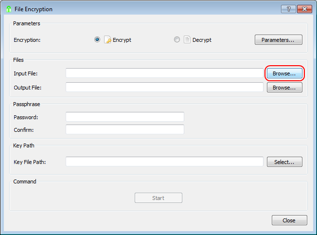

#Encrypt a binary file such as a picture or an archive

## Generate a new key file if you want to use a key file for encryption.

1\. Click the Generate Key tool button.

2\. Select the Key In Repository radio button and enter `my_new_key` in the corresponding text box and click OK.

3\. You will be asked to enter a password to protect the key file on the disk.

4\. Click **No** as it applies to the edited text and we are encrypting binary files.

## Encrypting a binary file

5\. Click the File Encryption tool button.

6\. Click Browse... to select an input file.

 

7\. Select an input file and click OK. The output file name and location will be suggested by adding `.epd` extension to your input file path (see the first image below). **IMPORTANT: to ensure that your output file is compatible with OpenGPG, change the extension from `.epd` to `.gpg` (see the second image below). Note that only `.epd` file with password protection is compatible with OpenPGP.**

8\. If you want to use a key file, specify it in the Key File Path text box by clicking Select Key... button. Note that either a password or key file should be used for GPG type and not both.

File without path is looked for in the EncryptPad directory first and then in the repository in HOME (see the text in the picture above). If your key is not in the repository, you can specify a full path to your key. 

`Persist key location in encrypted file` is not supported for GPG files (see README.md). Leave it blank for now. TODO:add the link to the EPD double encryption manual.

9\. Click Start

If you have not set a password and key file, EncryptPad will ask you to enter one.

10\. If encryption succeeds, you will see the following message.

