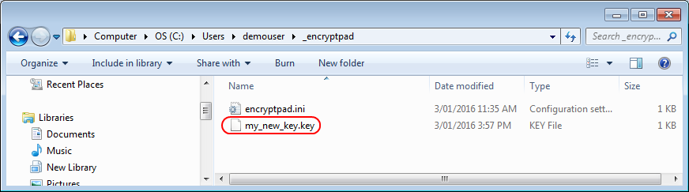
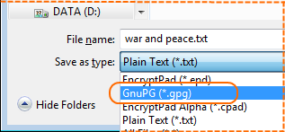

# Open a plain text file, protect it with a key file and save as a GPG file

## Open a plain text file

1\. Click the Open File tool button

2\. Select Plain Text file type and click Save button

3\. The plain text file opened

Now EncryptPad is in unprotected plain text mode. It works as an ordinary text editor.

## Generate a new key file

4\. Click the Generate Key tool button.

5\. Select the Key In Repository radio button and enter `my_new_key` in the corresponding text box and click OK.

6\. You will be asked to enter a passphrase to protect the key file on the disk.

Enter `KeyPwd`

7\. Click Yes to use the new key file to encrypt our text.

8\. You can look at the key file in your user profile directory under `_encryptpad`

Here is the content of the file (it will be different for you as the key is random):  

    -----BEGIN PGP MESSAGE-----
    
    ww0ECQMIwHjM/7M8CP1g0lwBTWLhkWz6OgNJ++rjgwES+WIWttapxGFG76nANeuC
    FtCIN9xGbsFFm1g9iJRxMgWlUz9s97+tC7PVhxgCDTsfbfbFA54UAdRClR0hqoPA
    S27p6/6u5ztvfGWGrw==
    =bXn9
    -----END PGP MESSAGE-----

This is a random sequence in Base64, from which the encryption key is derived. It is encrypted with the key file passphrase that you provided and it can also be unencrypted with GnuGPG. If you have [Gpg4Win](https://www.gpg4win.org/) installed, you can right click on the file in explorer and open "More GPG EX options" and "Decrypt". Enter `KeyPwd` as a passphrase and gpg will decrypt the file and create my_new_key.key.out. The content of the file will be similar to this:

    T6/vlnb0aysdr+xUriwwwrC844iVImiG4T/sCgF+ETQ=

## Protect with the key file and save as a GPG file

9\. Click the Save As tool button.

10\. Select GnuPG file type and click Save button

Please note that the file name has changed to `war and peace.gpg` in the Save As dialogue.

11\. Now the file has been saved on the disk and it is encrypted with the generated key file. See the status in the picture below.

## The GPG file on disk

It is an Open PGP file. You can send it to someone who does not have EncryptPad. It is easily decrypted with [Gpg4Win](https://www.gpg4win.org/). Use the content of the key file as a passphrase `T6/vlnb0aysdr+xUriwwwrC844iVImiG4T/sCgF+ETQ=` (see step 8).

GPG packet --list-packets command output:

    gpg --list-packets "war and peace.gpg"
    
    :symkey enc packet: version 4, cipher 9, s2k 3, hash 8
            salt 1c73cc8df90a54d5, count 65536 (96)
    gpg: AES256 encrypted data
    :encrypted data packet:
            length: 1201175
            mdc_method: 2
    gpg: encrypted with 1 passphrase
    :compressed packet: algo=2
    :literal data packet:
            mode t (74), created 0, name="CONSOLE",
            raw data: unknown length

## View or change the key file used for protection

12\. Click Set Key tool button.

13\. View the selected key file in Set Key dialogue

File without path is looked for in the EncryptPad directory first and then in the repository in HOME (see the text in the picture above). If your key is not in the repository, you can specify a full path to your key. 

`Persist key location in encrypted file` is not supported for GPG files (see README.md). Leave it blank for now. TODO:add the link to the EPD double encryption manual.

## Open another plain text file

If you try to open a plain text file now, it will fail with the following message.

EncryptPad "thinks" that the file is encrypted with a key file because its mode is "Key protected" as you can see in the status bar. It tried to decrypt the plain text and failed. To proceed with opening the file, clear key protection by clicking the Clear Key tool button or even better click Close and Reset. The latter will close the text file and reset both parts of the protection.

Now you can open your plain text file.
