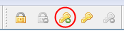
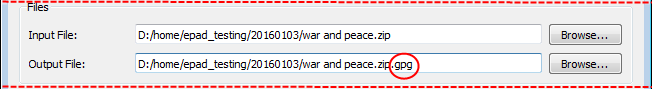
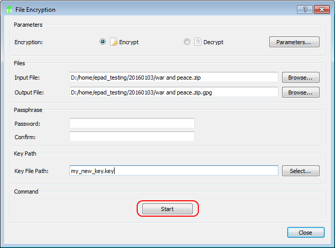

# Chiffrer un fichier binaire tel qu’une image ou un fichier compressé

## Générer un nouveau fichier clé si vous souhaitez utiliser un fichier clé pour le chiffrement.

1\. Cliquer sur le bouton «&nbsp;Générer une clé&nbsp;».

2\. Sélectionner le bouton radio «&nbsp;Clé dans le dépôt&nbsp;», saisir « ma_nouvelle_clé » dans la boîte de texte correspondante et cliquer sur OK.

3\. Il vous sera demandé de saisir une phrase de passe pour protéger le fichier clé sur le disque.

4\. Cliquer sur **Non**, car cela s’applique à un texte et que nous chiffrons des fichiers binaires.

## Chiffrer un fichier binaire

5\. Cliquer sur le bouton «&nbsp;Chiffrement du fichier&nbsp;».

6\. Cliquer sur «&nbsp;Parcourir...&nbsp;» pour sélectionner un fichier d’entrée.

 

7\. Sélectionner un fichier d’entrée et cliquer sur OK. Le nom et l’emplacement du fichier de sortie seront suggérés en ajoutant l’extension « epd » au chemin de votre fichier d’entrée (voir la première image ci-dessous). **IMPORTANT : pour garantir que le fichier de sortie est compatible avec OpenGPG, l’extension doit être changée de « epd » à « gpg » (voir la seconde image ci-dessous). Noter que seuls les fichiers « .epd » avec une protection par phrase de passe sont compatibles avec OpenPGP.**

8\. Si vous souhaitez utiliser un fichier clé, indiquez-le dans la zone de texte «&nbsp;Chemin du fichier clé&nbsp;» en cliquant sur le bouton «&nbsp;Sélectionner un fichier clé&nbsp;». Notez qu’une phrase de passe ou un fichier clé doit être utilisé pour le type GPG, mais pas les deux.

Les fichiers sans chemin sont d’abord cherchés dans le répertoire d’EncryptPad, puis dans le dépôt du dossier personnel (voir le texte de l’image ci-dessus). Si votre clé ne se trouve pas dans le dépôt, vous pouvez indiquer le chemin complet vers votre clé. 

L’« emplacement de clé persistante dans le fichier chiffré » n’est pas pris en charge pour les fichiers GPG (voir README.md). Laisser vide pour l’instant. À FAIRE : ajouter le lien vers le guide sur le double chiffrement EPD.

9\. Cliquer sur Lancer.

Si vous n’avez pas défini une phrase de passe ou un fichier clé, EncryptPad vous demandera dans saisir un.

10\. Si le chiffrement réussi, le message suivant apparaît :

