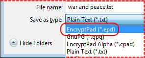
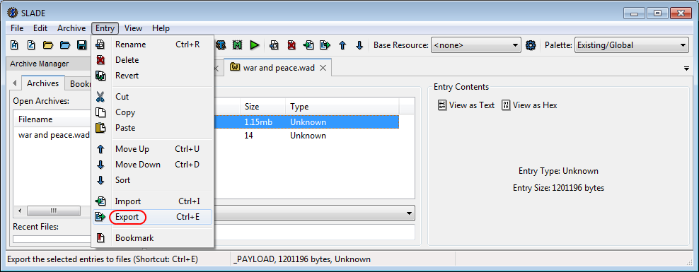

# Open a plain text file, protect it with both a key file and passphrase then save it as an EPD file

## Open a plain text file

1\. Click the Open File tool button

2\. Select Plain Text file type and click Save button

3\. The plain text file opened

Now EncryptPad is in unprotected plain text mode. It works as an ordinary text editor.

## Generate a new key file

4\. Click the Generate Key tool button.

5\. Select the Key In Repository radio button and enter `my_new_key` in the corresponding text box and click OK.

6\. You will be asked to enter a passphrase to protect the key file on the disk.

Enter `KeyPwd`

7\. Click Yes to use the new key file to encrypt our text.

8\. You can look at the key file in your user profile directory under `_encryptpad`

Here is the content of the file (it will be different for you as the key is random):  

`91Oamyib4o+Tbry/4NzoFOWhWpIfQE0TyMHiYtnOK9w=`

This is a random sequence in Base64, from which the encryption key is derived.

## Protect with the key file and save as a GPG file

9\. Click the Save As tool button.

10\. Select EncryptPad (\*.epd) file type and click Save button

Please note that the file name has changed to `war and peace.epd` in the Save As dialogue.

11\. You will be asked to enter a passphrase twice. Enter `DemoPwd` for this example and click OK.

Note that if you leave the passphrase blank and click OK, the file will be only protected with the key file and you will not have the double protection. 

12\. Now the file has been saved on the disk and it is encrypted with the generated key file and then the passphrase. See the status in the picture below.

## Persist the key file location in the encrypted file

Now if you clear protection, close the file and open it again, you will be asked for both the passphrase and key file. It may be cumbersome to enter the path to the key file every time, especially if it is not in the repository. To make it easier you can enable `Persist key location in encrypted file` (this feature is only supported in the EPD file type).

13\. Click Set Key tool button.

14\. Enable `Persist key location in encrypted file` in the Set Key dialogue and click OK.

15\. The status bar has changed (see the picture below).

If you clear protection and open this file again, you will not be asked for the key file location as it is persisted in the encrypted file itself. It is also hidden from unwanted view because the location is encrypted with the passphrase.

16\. Click the Save tool button to save the file.

## Open another plain text file

If you try to open a plain text file now, it will fail with the following message.

EncryptPad "thinks" that the file is encrypted with a passphrase and key file because its mode is `Key protected` and `passphrase protected` as you can see in the status bar. It tried to decrypt the plain text and failed. To proceed with opening the file, clear passphrase and key protection by clicking the Clear Key and Clear passphrase tool buttons or even better click Close and Reset. The latter will close the text file and reset both parts of the protection.

Now you can open your plain text file.

## The internals of the EPD file

The EPD file is an OpenPGP file containing a [WAD](https://en.wikipedia.org/wiki/Doom_WAD) file, which contains another OpenPGP file. There is three levels of nesting. To demonstrate, we can extract the encrypted text without using EncryptPad.

17\. Rename the file from `war and peace.epd` to `war and peace.gpg`.

18\. Decrypt the file with [Gpg4Win](https://www.gpg4win.org/). Use `DemoPwd` as a passphrase.

19\. Rename the file produced by Kleopatra from `war and peace` to `war_and_peace.wad`.

20\. You need to get a tool for working with WAD files for the next step. I recommend [Slade](https://github.com/sirjuddington/SLADE).

21\. Extract the content of the wad file with Slade. See the window below for details.

Note that the `__X2_KEY` file contains the name of our key file `my_new_key.key`. `_PAYLOAD` is the OpenPGP file encrypted with the key file. 

22\. Save `_PAYLOAD` to the disk. Click Entry->Export and save the file as **war and peace.gpg**. Overwrite the existing file we used at previous steps.

23\. Decrypt the key file `my_new_key.key` with [Gpg4Win](https://www.gpg4win.org/). Use `KeyPwd` as a passphrase.

24\. Now that we have the unencrypted key file, decrypt the file from step 22 with [Gpg4Win](https://www.gpg4win.org/). Use the content of the key file from step 23 as a passphrase.

25\. The result of this decryption will be your original plain text file.

