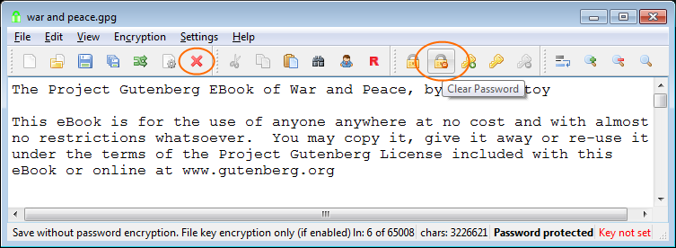

# Ouvrir un fichier texte en clair, le protéger par phrase de passe et l'enregistrer comme fichier GPG

Nous allons ouvrir un fichier texte en clair, le protéger par phrase de passe et l'enregistrer comme fichier GPG.

## Ouvrir un fichier texte en clair

1\. Cliquez sur le bouton «&nbsp;Ouvrir un fichier&nbsp;».

2\. Sélectionnez le type de fichier «&nbsp;Texte en clair&nbsp;» et cliquez sur Enregistrer.

3\. Le fichier texte en clair ouvert.

EncryptPad est maintenant en mode texte en clair non protégé. Elle fonctionne comme un éditeur de texte ordinaire.

## Protéger avec une phrase de passe et enregistrer comme fichier GPG

4\. Cliquez sur le bouton «&nbsp;Enregistrer sous&nbsp;».

5\. Sélectionnez le type de fichier GnuPG et cliquez sur Enregistrer.

Veuillez prendre note que le nom de fichier a changé en «&nbsp;guerre et paix.gpg&nbsp;» dans la boîte de dialogue «&nbsp;Enregistrer sous&nbsp;».

6\. Il vous sera demandé de saisir deux fois une phrase de passe. Saisissez `MdpDémo` et cliquez sur OK

7\. Le fichier a maintenant été enregistré sur le disque, chiffré avec notre phrase de passe. Voir l'extension du fichier et l'état dans l'image ci-dessous.

## Le fichier GPG sur le disque

C'est un fichier OpenPGP. Vous pouvez l'envoyer à quelqu'un qui n'a pas EncryptPad. On peut par exemple le déchiffrer facilement avec [Gpg4Win](https://www.gpg4win.org/).

Sortie de la commande --list-packets du paquet GPG :

`gpg --list-packets "guerre et paix.gpg"` 

`:symkey enc packet: version 4, cipher 9, s2k 3, hash 8` 
`salt 9cd701f1d2e0aca8, count 65536 (96)` 
`gpg: données chiffrées avec AES256` 
`:encrypted data packet:` 
`length: 1201175` 
`mdc_method: 2` 
`gpg: chiffré avec 1 phrase secrète` 
`:compressed packet: algo=2` 
`:literal data packet:` 
`mode t (74), created 0, name="CONSOLE",` 
`raw data: unknown length` 

## Mettre le fichier à jour

Si vous modifiez maintenant le texte et cliquez sur le bouton Enregistrer, EncryptPad ne vous demandera pas de saisir la phrase de passe de nouveau, car elle stocke plusieurs hachages salés de votre phrase de passe.

## Ouvrir un autre fichier texte en clair

Si vous tentez d'ouvrir un fichier texte en clair maintenant, cela échouera avec le message suivant :

EncryptPad pense que le fichier est chiffré avec une phrase de passe, car son mode est «&nbsp;Protégé par phrase de passe&nbsp;», comme vous pouvez le voir dans la barre d'état. Elle a tenté de déchiffrer le texte en clair et a échoué. Pour poursuivre l'ouverture du fichier, effacez la protection par phrase de passe en cliquant sur le bouton «&nbsp;Effacer la phrase de passe&nbsp;», ou mieux encore, en cliquant sur «&nbsp;Fermer et réinitialiser&nbsp;» ce qui fermera le fichier texte et réinitialisera la protection.

Vous pouvez maintenant ouvrir votre fichier texte en clair.